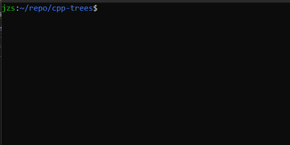

# A Simple Command Line Tree Navigator in C++

Is there anything more to be said?

## Try it out...

1. Clone the repository.
1. Run `./build.sh`

## Commands available

* `ls`
* `pwd`
* `cd`
* `touch`
* `exit`

## More commands coming soon...

* `rm`
* `mv`

...and many more... (maybe...)
